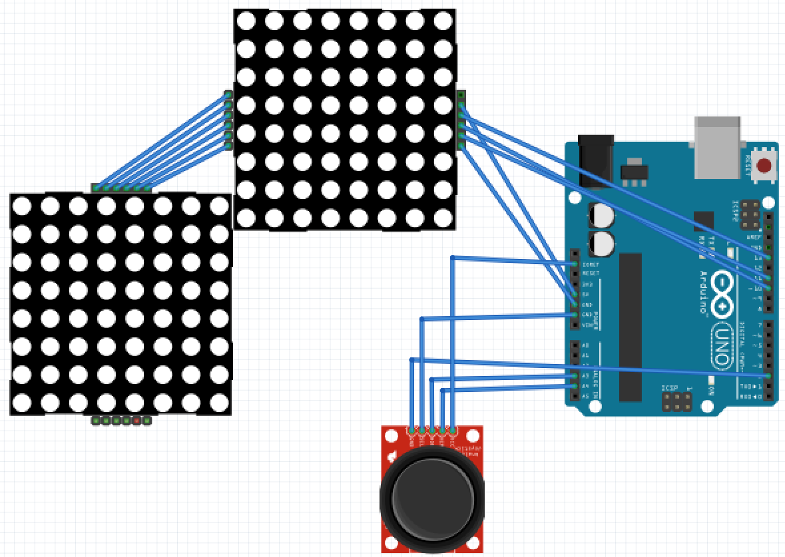
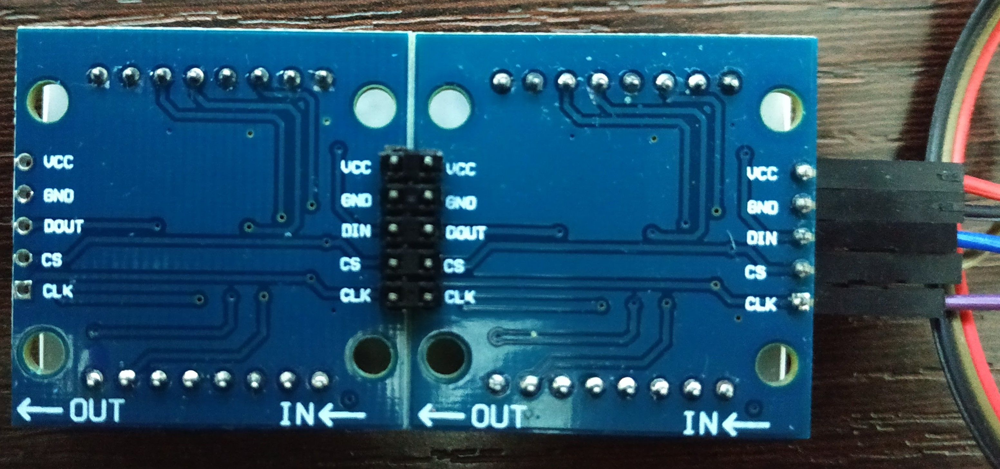
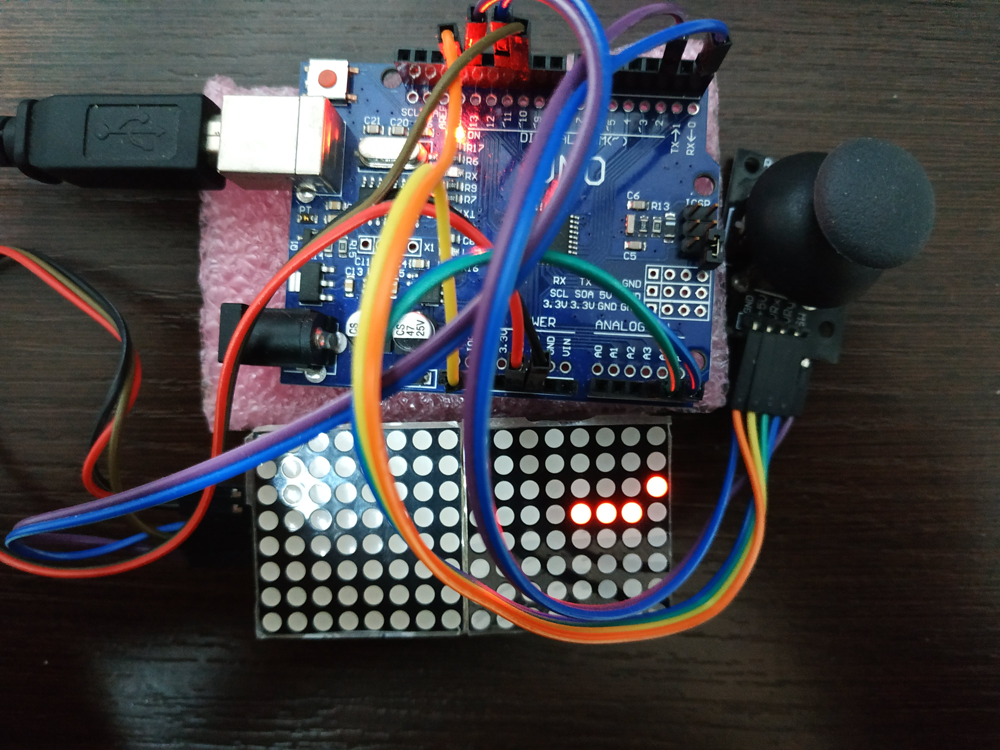

# Arduino-Matrix-LED

Software for Arduino Uno/Nano to control 8x8 dot matrix LED based on MAX7219 ICs in FC-16 boards with led matrix model 1088AS


## Features
- Configurable matrix size by attaching multiple LED Matrixes
- Configurable marquees and animations to display
- Interactive games using joystick: Snake~~ and Tetris~~

### Hardware components used for Led Cube

- Arduino [Uno](https://store.arduino.cc/arduino-uno-rev3)/[Nano](https://store.arduino.cc/arduino-nano) or compatible
- 8x8 dot matrix LEDs model 1088AS with MAX7219 in [FC-16](https://majicdesigns.github.io/MD_MAX72XX/page_f_c16.html) boards
- Battery or USB powerbank [ 5V,  +2000 mAh ]
- Joystick analog 2-Axis with button for interaction with games

### Software structure

The software is splitted into [Abstraction Layers](https://en.wikipedia.org/wiki/Abstraction_layer) so the responsability of each layer are very limited and will make easier the growth and maintenance of the project in a Architectural point of view. Using a objected-oriented language such as C++ accepted by Arduino, makes the implementation closer to this approach.

**Dependencies**: Needs to have access to _Arduino-Generic-Libraries/lib_ in this same repository
```
Arduino-Matrix-LED
|--lib
|  |--LM_Game
|  |  |- CLedGame_Tetris.cpp
|  |  |- CLedGame_Snake.cpp
|  |  |- CLedGame.cpp
|  |  |- CLedGame.h
|  |  |- CLedGameController.h
|  |--LM_Marquee
|  |  |- CLedMarquee.cpp
|  |  |- CLedMarquee.h
|  |  |- CLedEyes.cpp
|  |  |- CLedEyes.h
|--src
|  |- main.cpp
|  |- main.h
|- platformio.ini
Arduino-Generic-Libraries
|--lib
|  |--Common_Lib
|  |--Joystick_Lib
|--external-libs
|  |--MD_MAX72XX
|  |--LowerPower
|  |--TrueRandom
|  |--LinkedList
```

### Electrical schematics
[Fritzing Schematics](doc/sketch.fzz)
<br/>


### Build/assembly photos
| **Two-matrix leds backpart** | **Assembly for Snake game** |
| ----------- | ------------------- |
|  |  |